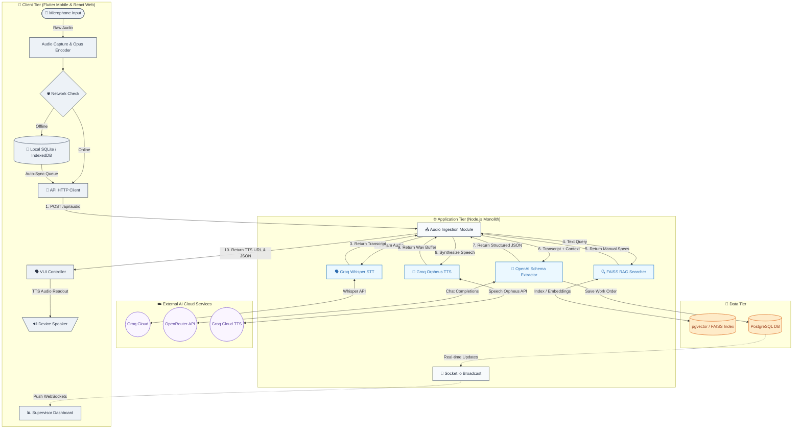
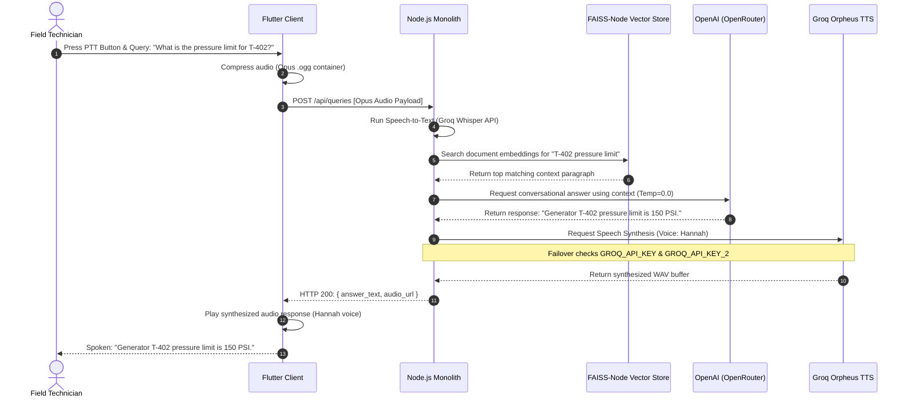

# FieldVoice AI: Voice-First AI Assistant for Field Workers

FieldVoice AI is an enterprise-grade, voice-first monorepo application designed specifically for field technicians and supervisors in high-noise industrial environments (e.g., power plants, manufacturing facilities). The system enables hands-free inspections, natural language work order logging with an interactive voice confirmation loop, vector-based (RAG) technical manual search, and offline data queuing.

It is structured as a robust **monorepo** consisting of:
1.  **Node.js / Express Backend Monolith**: Serves REST and WebSocket endpoints, manages PostgreSQL and `pgvector` operations, coordinates custom AI pipelines (Whisper STT, LLM parsing, FAISS RAG), and implements dynamic API key rotation with file caching.
2.  **Next.js Web Dashboard**: Provides supervisors with real-time technician streams, playable voice logs with transcripts, and audit tools to resolve low-confidence parse exceptions.
3.  **Flutter Mobile Application**: A ruggedized technician client supporting background wake-word listening, Bluetooth headset integration, real-time visual sound wave feedback, and local SQLite offline queueing.

---

## 🚀 Key Capabilities & Innovations

*   **Hands-Free Voice Confirmation & Loop**: Technicians speak inspection logs, hear a synthesized readback of parsed data, and can state natural language modifications (e.g., *"change severity to critical"*) or verify verbally (*"confirm"* / *"cancel"*), entirely screen-free.
*   **API Key Rotation & Failover**: Active-passive failover between primary (`GROQ_API_KEY`) and secondary (`GROQ_API_KEY_2`) keys on backend text-to-speech requests to prevent rate limit (TPD) exhaustion.
*   **Static Template TTS Caching**: MD5 hashing and local caching of static vocal messages (e.g., "inspection started") to significantly reduce external API dependencies.
*   **RAG Document Search**: Similarity indexing of manual PDFs using localized FAISS-Node and pgvector, yielding conversational, spoken-optimized answers inside a 3-second SLA.
*   **Idempotent Offline Sync Daemon**: Device-local transaction queuing in SQLite (mobile) or IndexedDB (web) using unique UUID payloads to prevent duplicate work orders on the backend upon network reconnection.
*   **Supervisor Audit Portal**: Real-time Socket.io streams highlighting data-entry warnings and low-confidence transcribing exceptions for supervisor correction.

---

## 🏗️ System Architecture & Data Flow

### 🔄 Logical Architecture Flowchart



### ⏱️ End-to-End Query Response Sequence (RAG Pipeline)



---

## 🗄️ Database Schema & Relational Structure

The persistence layer uses a PostgreSQL relational database. Below is the Entity-Relationship structure and indexing strategy implemented to optimize analytical read speeds and JOIN operations.

```
                           +------------------------+
                           |        workers         |
                           +------------------------+
                           | id (UUID, PK)          |
                           | username (VARCHAR)     |
                           | full_name (VARCHAR)    |
                           | role (role_enum)       |
                           | is_active (BOOLEAN)    |
                           | created_at (TIMESTAMPTZ|
                           +-----------┬------------+
                                       | 1
                                       |
                                       | 0..* (logged_by)
                                       ▼
+-----------------------+  1   +------------------------+
|       equipment       |<─────|      work_orders       |
+-----------------------+      +------------------------+
| id (UUID, PK)         |      | id (UUID, PK)          |
| tag (VARCHAR, Unique) |      | equipment_id (UUID, FK)|
| name (VARCHAR)        |      | fault_code (VARCHAR)   |
| location (VARCHAR)    |      | severity (severity_enum|
| specifications (JSONB)|      | status (status_enum)   |
| created_at (TIMESTAMPTZ      | actions_taken (TEXT)   |
+-----------------------+      | parts_required (ARR)   |
                               | offline_created_at (TS)|
                               | created_at (TIMESTAMPTZ|
                               +-----------┬------------+
                                           | 1
                                           |
                                           | 0..*
                                           ▼
                               +------------------------+
                               |   voice_transcripts    |
                               +------------------------+
                               | id (UUID, PK)          |
                               | work_order_id (UUID,FK)|
                               | raw_transcript (TEXT)  |
                               | confidence_score (NUM) |
                               | exception_flag (BOOL)  |
                               | audio_storage_url (VAR)|
                               | created_at (TIMESTAMPTZ|
                               +------------------------+
```

### Performance Optimization Indexes
To ensure fast execution of queries displaying real-time technician feeds and search lists:
*   `idx_work_orders_eq_id` on `work_orders(equipment_id)`
*   `idx_work_orders_logged_by` on `work_orders(logged_by)`
*   `idx_transcripts_wo_id` on `voice_transcripts(work_order_id)`

---

## 📡 API Interface Specification

<details>
<summary><b>1. Speech Processing & Extraction [POST /api/audio/process]</b></summary>

Receives raw inspection audio, runs speech-to-text, parses entities, and generates TTS confirmation response.

*   **Content-Type**: `multipart/form-data`
*   **Request Payload**:
    *   `audio`: Opus encoded file (`.ogg`, max 10MB)
    *   `technician_id`: `e3b0c442-98fc-1111-b303-0242ac120002` (UUID)

*   **Response Payload (HTTP 200)**:
    ```json
    {
      "transaction_id": "tx-abc-123",
      "raw_transcript": "log inspection generator T-402 oil leak severity high",
      "confidence_score": 0.945,
      "exception_flag": false,
      "parsed_fields": {
        "equipment_id": "COMP-7A",
        "location": "Basement Sump",
        "fault_code": "F-LEAK-OIL",
        "severity": "High",
        "actions_taken": "Closed isolation valve",
        "parts_required": ["Gasket Kit", "Sealant"]
      },
      "tts_audio_url": "/uploads/speech-172839482.wav"
    }
    ```
</details>

<details>
<summary><b>2. RAG Knowledge Manual Queries [POST /api/queries]</b></summary>

Resolves technical manuals and system history queries using similarity vector retrieval and outputs plain text with matching source documentation.

*   **Content-Type**: `application/json`
*   **Request Payload**:
    ```json
    {
      "query_text": "What is the oil pressure limit for Generator T-402?",
      "technician_id": "e3b0c442-98fc-1111-b303-0242ac120002"
    }
    ```

*   **Response Payload (HTTP 200)**:
    ```json
    {
      "answer": "The oil pressure limit for Generator T-402 is 150 PSI.",
      "source_documents": [
        "Turbine manual section 4.2: Max operating pressure 150 PSI."
      ],
      "tts_audio_url": "/uploads/cached-speech-abc123hex.wav"
    }
    ```
</details>

<details>
<summary><b>3. Voice Correction Update [POST /api/extraction/update]</b></summary>

Applies natural language updates to currently parsed fields in the voice confirmation loop.

*   **Content-Type**: `application/json`
*   **Request Payload**:
    ```json
    {
      "currentData": {
        "equipment_id": "T-402",
        "fault_code": "F-LEAK-OIL",
        "severity": "HIGH",
        "parts_required": []
      },
      "changeRequest": "actually change severity to critical and add a sealant"
    }
    ```

*   **Response Payload (HTTP 200)**:
    ```json
    {
      "success": true,
      "updated_fields": {
        "equipment_id": "T-402",
        "fault_code": "F-LEAK-OIL",
        "severity": "CRITICAL",
        "parts_required": ["Sealant"]
      },
      "tts_audio_url": "/uploads/speech-updated-1823794.wav"
    }
    ```
</details>

<details>
<summary><b>4. Offline Sync Batch Ingestion [POST /api/sync/batch]</b></summary>

Receives batched offline recordings along with chronological metadata, ensuring write idempotency.

*   **Content-Type**: `multipart/form-data`
*   **Request Payload**:
    *   `manifest`: JSON metadata string
    *   `audio_1`, `audio_2`: File binaries
*   **Response Payload (HTTP 207 Multi-Status)**:
    ```json
    {
      "processed_count": 2,
      "results": [
        { "uuid": "uuid-1234", "status": "SUCCESS" },
        { "uuid": "uuid-5678", "status": "DUPLICATE_SKIPPED" }
      ]
    }
    ```
</details>

---

## 📁 Repository Directory Layout

<details>
<summary><b>Click to expand Repository Folder Structure</b></summary>

```
fieldvoice-ai/
├── backend/                       # Express.js Backend Application
│   ├── src/                       # Application Source Files
│   │   ├── config/                # Service clients & environment setup
│   │   │   ├── db.js              # PostgreSQL client connection pool
│   │   │   ├── groq.js            # Groq API client config (Whisper STT)
│   │   │   └── openrouter.js      # OpenRouter API client config (LLM)
│   │   ├── controllers/           # API Controller logic handlers
│   │   │   ├── audioController.js # Handles uploads, transcribes, and extracts
│   │   │   ├── orderController.js # Handles manual CRUD and updates
│   │   │   └── queryController.js # Handles vector search and Q&A answers
│   │   ├── db/                    # PostgreSQL Migrations & Seeding
│   │   │   ├── init.js            # SQL DB Initializer Schema code
│   │   │   └── seeds/             # Starter data (mock assets, manuals)
│   │   ├── models/                # Database Model Queries
│   │   │   ├── Equipment.js       # Queries for asset tags and metadata
│   │   │   ├── WorkOrder.js       # Queries for creating/updating orders
│   │   │   └── Worker.js          # Queries for technician directories
│   │   ├── routes/                # Express API Route definitions
│   │   ├── services/              # Core Domain Services
│   │   │   ├── faissService.js    # FAISS-Node search and indexing service
│   │   │   ├── llmService.js      # OpenAI prompt parser using OpenRouter
│   │   │   ├── ttsService.js      # CanopyLabs Orpheus TTS with Failover Rotation
│   │   │   └── syncService.js     # Batch queue database sync logic
│   │   ├── index.js               # Express application entry point
│   │   └── sockets.js             # Socket.io connection coordinator
│   ├── package.json               # Backend dependencies
│   └── .env.example               # Backend environment variables
│
├── frontend/                      # Next.js Client Application
│   ├── public/                    # Static Assets (audio chimes, icons)
│   ├── src/                       # Client Source Files
│   │   ├── app/                   # Next.js App Router View pages
│   │   ├── components/            # Reusable React UI Components
│   │   ├── hooks/                 # Client Hooks (Voice & Network logic)
│   │   ├── utils/                 # Client-side utility functions
│   │   ├── package.json           # Frontend dependencies
│   │   └── .env.example           # Frontend environment variables
│
├── mobile/                        # Flutter Mobile Application
│   ├── lib/                       # Flutter Source Code
│   │   ├── screens/               # Screen widgets (home_screen.dart)
│   │   ├── services/              # APIs, Audio services, and Bluetooth
│   │   └── main.dart              # App bootstrap entrypoint
│   ├── pubspec.yaml               # Flutter package configuration
│   └── README.md                  # Mobile project starting guide
│
├── render.yaml                    # Render.com Cloud Deployment template
├── README.md                      # Monorepo root README
└── package.json                   # Monorepo workspace root configuration
```
</details>

---

## 🛠️ Installation & Setup Instructions

### Prerequisites
*   **Node.js**: v18.0.0 or higher
*   **Flutter SDK**: v3.19.0 or higher
*   **PostgreSQL**: v14.0 or higher (with `pgvector` enabled)

---

### 1. Database Setup
Create your PostgreSQL database instance and configure connectivity:
```sql
CREATE DATABASE fieldvoice;
-- (The backend service will automatically enable the uuid-ossp extension and seed tables on boot)
```

---

### 2. Backend Service Setup
1.  Navigate to the backend directory and install dependencies:
    ```bash
    cd backend
    npm install
    ```
2.  Create your local `.env` configuration file:
    ```bash
    cp .env.example .env
    ```
3.  Configure variables inside `.env`:
    ```ini
    PORT=3000
    GROQ_API_KEY=your_primary_groq_api_key
    GROQ_API_KEY_2=your_secondary_groq_api_key
    OPENROUTER_API_KEY=your_openrouter_api_key
    
    PGHOST=127.0.0.1
    PGPORT=5432
    PGUSER=postgres
    PGPASSWORD=your_password
    PGDATABASE=fieldvoice
    PGSSL=false
    ```
4.  Boot up the tables schema and seed data, then launch the API server:
    ```bash
    node src/db/init.js  # Runs schema migrations & mock seeds
    npm run dev          # Runs Express backend in development mode
    ```

---

### 3. Frontend Web Dashboard Setup
1.  Navigate to the frontend folder and install packages:
    ```bash
    cd ../frontend
    npm install
    ```
2.  Run the Next.js supervisor dashboard client locally:
    ```bash
    npm run dev
    ```
    *The web application dashboard will start at `http://localhost:3001`.*

---

### 4. Mobile Client Setup (Flutter)
1.  Navigate to the mobile directory:
    ```bash
    cd ../mobile
    flutter pub get
    ```
2.  Ensure an Android device or emulator is running:
    ```bash
    flutter devices
    ```
3.  Launch the application on the active device:
    ```bash
    flutter run
    ```
4.  Build a debug APK package for direct installation:
    ```bash
    flutter build apk --debug
    ```

---

## 🧪 Testing Specifications

We maintain a comprehensive, automated test suite on the backend to verify service limits and schema integrity.

### 50 Integration & Unit Tests
Tests cover:
*   `sttService.test.js`: Audio limits checks, size constraints (>25MB errors), and extensions mapping.
*   `extractionService.test.js`: Valid JSON extraction schema audits and severity fallbacks.
*   `queryService.test.js`: Local vector matches and timeout child-process termination limits.
*   `sse.test.js`: Server-sent event client register, broadcast, and removal loops.
*   `workOrderService.test.js`: Database queries transactions validation and rollback checks.

Run the test suite:
```bash
cd backend
npm run test
```
